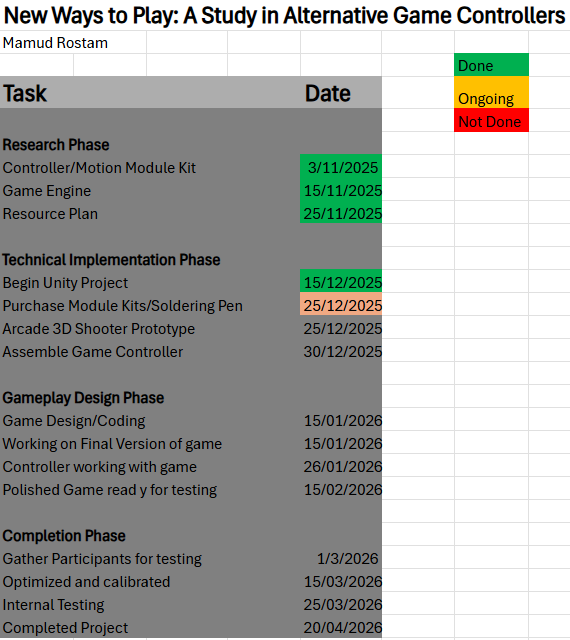

# Mamud_Final_Year_Project (CMP6200 Individual Honours Project A AYR 2025/6)

# Introduction
This project explores new forms of game interaction by developing a custom controller that will support motion control using Arduino Hardware. Instead of relying on traditional keyboard or joystick inputs, the controller uses motion sensing technology to aim within a shooter game environment, while physical buttons enable actions such as shooting. 

The purpose of this study is to investigate whether alternative game controllers can:

* Improve accessibility
* Enchance Immersion
* Introduce new creative ways to interact with games

# Objectives and Motivation

# Research 
* Researching player experience with alternative game controllers
* Understanding benefits for accessibility and engagement
* Comparing traditional vs non traditional controllers

# Development
* Building a fully functional scene within Unity that supports a custom built motion based inpuit device
* Building a custom controller using Arduino Kits
*  Conduct user testing

I believe that not all players can or want to use standard controllers, and that a new form of controller can transform how games are played.

# Technology and Tools

* Arduino Kit (motion sensors and buttons)
* Unity Engine for game development
* C# - Development of scripts
* GitHub (for kanban and workflow)

# Game and Controller summary

Motion Controller
* Tracks orientation to aim a weapon in game
* Button inputs trigger firing and interactions
* Designed to feel like a handheld pointing device

Game prototype
* Shooter game with motion based aiming
* Basic enemy targets for testing accuracy + responsiveness
* Captures gameplay metrics for evaluation

# Design Process and Development
* Interim Project Report 3/11/2025 at 3 PM
* Interim Progress Review 08/12/2025
* Final Progress Review 02/03/2026 
* Final Report (Written Report & Artefact) 05/05/2026 at 3 PM
* Poster and Viva 11/05/2026 

* (Between those reports development of my project will be in happening)
* Concept research and brainstorm
* Testing
* Controller prototype
* Unity intergration and input mapping
* Play testing + iterative improvements

# Project Management

* Weekly supervisor meetings to review design, technicaly challenges and scope
* GitHub Kanban board used to track milestones and tasks

# Supervisor Feedback

* Several meetings with my supervisor going over ideas and keep track of the project time to ensure the best quality. 

* Created a Kanban in GitHub which allows for easy schedule of my workflow also so the supervisor can keep track of where i am.

* Completed the CMP/DIG6200 Interim Project Report on the 3rd November 2025.

# Gantt Chart 

# Dependencies
* Unity 3D

# Platforms 
* Available on Windows 10 or 11

# Contacts

Mamud.rostam@mail.bcu.ac.uk